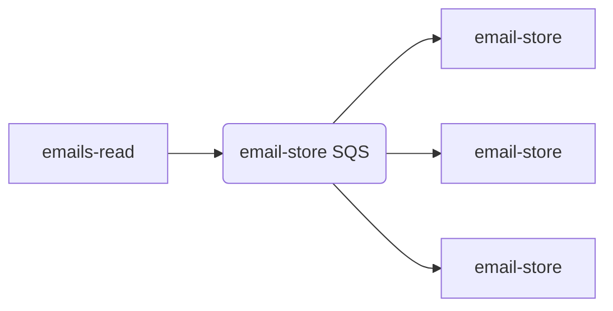
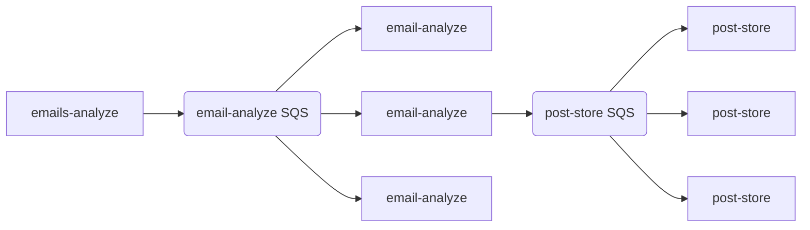

## Emails Flow

### 1 Emails read

```mermaid
flowchart LR
    A[emails-read] --> B(email-store SQS)
    B --> C1[email-store]
    B --> C2[email-store]
    B --> C3[email-store]
```

### 2 Emails analyze

```mermaid
flowchart LR
    A[emails-analyze] --> B(email-analyze SQS)
    B --> C1[email-analyze]
    B --> C2[email-analyze]
    B --> C3[email-analyze]
    C2 --> D(post-store SQS)
    D --> E1[post-store]
    D --> E2[post-store]
    D --> E3[post-store]
  
```